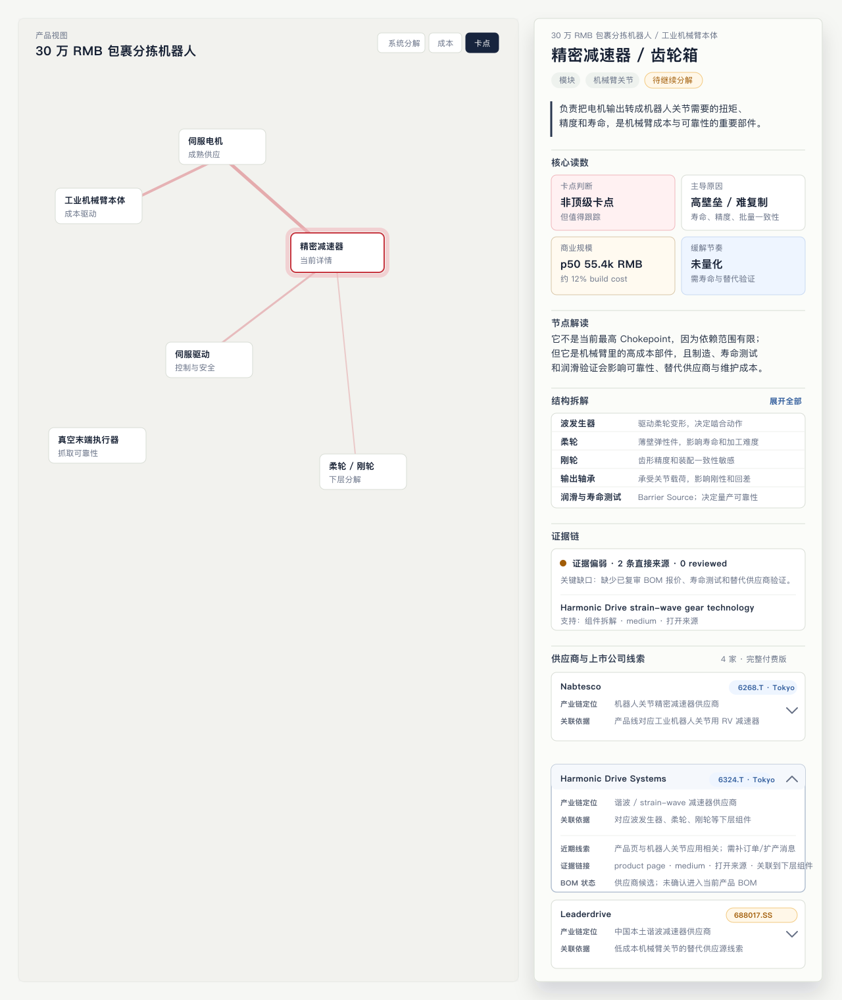

# Node Detail IA: Commercial Supplier Lines

**Date:** 2026-06-19
**Status:** Current implementation decision. Use this document as the source of
truth for the next node-detail execution slice. Where it conflicts with the
historical `docs/plans/launch-detail-rail-priority.md`, this document wins for
selected-node detail IA and supplier/company card behavior.

**Implementation status:** The node detail rail now follows this IA for the
supplier/company card surface and the primary sequence: no standalone
`Inspect next` block, `结构拆解` before evidence, evidence status outside the
core readout, and supplier cards that expose ticker, `产业链定位`, and `关联依据`
in collapsed state.

## Purpose

The node detail rail must help a public-market retail investor understand a
technical node quickly, then inspect company/supplier/ticker exposure as the
commercial diligence path. The graph remains the reasoning substrate; the rail
is the explanation layer anchored to the selected graph node.

This is not stock advice. Company and ticker information is evidence and
exposure context, not a recommendation.

## Final Section Order

Use this order for the selected-node detail surface:

1. **Node header**
   - Node name, route breadcrumb, compact kind/context pills, and frontier state
     if relevant.
2. **Plain-language role sentence**
   - One sentence explaining what this node does in the selected product.
3. **Core readout**
   - `卡点判断`
   - `主导原因`
   - `商业规模`
   - `缓解节奏`
4. **`节点解读`**
   - A short interpretation of why the readout says what it says.
   - Do not prefix this with "impact on the whole product"; the section title
     already creates that context.
5. **`结构拆解`**
   - Default to 5 child items.
   - Let the user expand to all children.
   - Each child item explains the child's function in one line; it is not a
     replacement for that child's own detail panel.
6. **`证据链`**
   - Evidence status, source links, review state, and source gaps live here.
   - Do not duplicate evidence status inside the core readout.
7. **`供应商与上市公司线索`**
   - The primary commercial path for paid or future-paid diligence.
   - Show enough in collapsed cards that the section feels materially useful.
8. **Collapsed appendix**
   - Raw metrics, maturity history, raw relations, audit details, and other
     operator-level material.

Do not add a separate "Inspect next / 下一步查看" section in this version. The
rail should be tighter: node interpretation, decomposition, evidence, and
commercial exposure are the main sequence.

## Why This Shape

The intended user first needs to understand the node's industrial meaning, then
why it matters, then whether there is investable company exposure. Leading with
raw graph metadata, evidence counts, or full upstream/downstream lists makes
the surface feel like an internal database instead of an investor research
tool.

The main priority is:

1. What is this node in the product?
2. Is it a chokepoint or commercially important constraint?
3. Why is that judgment reasonable?
4. What is it made of, and what subparts explain the difficulty?
5. What evidence supports the claims?
6. Which suppliers or listed companies are related, and why?

## Core Readout Rules

The core readout should be a small set of high-signal tiles. It should not
become a general status dashboard.

Recommended fields:

| Field | Purpose |
|---|---|
| `卡点判断` | Composite Chokepoint verdict or candidate status. |
| `主导原因` | The leading structural reason: Dependency, Concentration, or Barrier in plain language. |
| `商业规模` | Cost, BOM share, revenue pool, or another modeled commercial magnitude when available. |
| `缓解节奏` | Whether substitution, capacity expansion, or validation timing is known. |

Evidence status does not belong here. Evidence is important, but in this IA it
belongs in `证据链` and in expanded company evidence rows. This keeps the first
readout about the node's meaning rather than the database's audit state.

## `节点解读`

Use `节点解读` as the section name.

Do not use:

- `为什么这样判断`
- `判断原因`
- `对总产品的影响`

Rationale: `节点解读` is broad enough to explain the readout, the product impact,
and the commercial implication without sounding like a single internal score
explanation. It should remain short, concrete, and graph-backed.

## `结构拆解`

Keep this section in the detail rail.

Rationale: even though child nodes have their own detail panels, the parent
detail should give the user a one-glance map of what the node contains and what
each child does. This prevents click-by-click discovery for users who only need
orientation.

Rules:

- Show 5 children by default.
- Provide `展开全部` when more children exist.
- Show child name plus one functional phrase.
- Do not dump child evidence, metrics, or company lists here.
- Barrier-source or know-how child items may appear when they explain Barrier,
  lifetime, manufacturability, holder scarcity, evidence gaps, or chokepoint
  logic.
- This section appears before evidence and supplier/company cards. It replaces
  the older standalone `Inspect next` prompt as the user's orientation layer.

## `供应商与上市公司线索`

This section is the main commercial path. It should feel thicker than a generic
related-companies list, but it must remain evidence-driven.

### Section Title

Use:

```text
供应商与上市公司线索
```

Do not use:

- `相关公司与股票线索`
- `公司股票线索`
- `相关公司`

Rationale: the final title says what the section is for: supplier exposure plus
public-market mapping. It is direct enough for retail investors and less vague
than a generic "related companies" label.

### Collapsed Company Card

Collapsed cards should show only the most decision-relevant material:

1. Company name.
2. Ticker/listing pill, when available, for example `6268.T · Tokyo`.
3. `产业链定位`.
4. `关联依据`.

Do not show in collapsed state:

- Evidence status.
- Evidence links.
- `商业信号`.
- `关系类型`.
- `角色`.
- `上市公司已映射`.
- Long BOM, news, confidence, or review-state text.

Rationale: in the collapsed state, the user is scanning "who is this and why is
it relevant?" A ticker makes the line feel like a real public-market clue.
Evidence and links are important, but they are detail-layer material and should
appear after expansion.

### Field Naming

Use:

| Final label | Meaning |
|---|---|
| `产业链定位` | The company's position in the industrial chain, expressed directly: supplier, service provider, equipment vendor, material supplier, integrator, etc. |
| `关联依据` | The reason this company is connected to the node/product, backed by graph data and evidence. |

Do not use `关系类型` in the UI. It is too abstract for this surface.

Do not use `角色` for the card field. It overlaps with `关联依据` and is less
precise than `产业链定位`.

### Expanded Company Card

Expanded cards may show:

- `证据链接`: source links that support the company-to-node or
  company-to-product relation.
- `近期线索`: recent news, orders, capacity expansion, product-line updates, or
  other time-sensitive commercial context when present.
- `财务/产能线索`: revenue exposure, capacity, market share, or shipment signals
  when present and evidenced.
- `BOM 状态`: whether this is confirmed in the modeled product BOM, a supplier
  candidate, an alternative supplier, or a still-unverified lead.
- Confidence/review state when needed for honesty.

Avoid a single generic `商业信号` label. It is too vague. Split it into the
specific kind of signal the product actually has.

### Roll-up And Ranking Rules

Supplier/company cards are not limited to edges directly attached to the
selected node.

Rules:

- First collect direct organization edges from the selected node.
- Then collect supplier/company edges from descendant artifact nodes up to four
  decomposition levels below the selected node.
- Deduplicate by organization after ranking, not before ranking, so a stronger
  supplier relation can replace a weaker duplicate relation.
- Rank supplier relations ahead of owner/operator/comparable relations:
  `manufactured_by`, `qualified_supplier`, `reported_capable_supplier`,
  `strategic_supplier_to`, and `capacity_provider` outrank
  `second_source_candidate` and `implemented_by`.
- Prefer public/listed-company cards when otherwise comparable, because this
  section is the commercial diligence path.
- Use `second_source_candidate` and `implemented_by` cards only when they do
  not crowd out actual supplier/manufacturer leads.

Rationale: many useful commercial clues live at component or material leaves.
Upper product and route nodes should still feel commercially useful, but their
collapsed cards should not be dominated by product owners, operators, or broad
public comparables when actual supplier exposure exists deeper in the graph.

## Repository Check

The repository has a machine check for this IA:

```bash
npm run check:node-detail-ia
```

The check scans every `DOMAIN_ROUTES` product graph for:

- missing role-source descriptions;
- missing root decomposition;
- supplier/company edges pointing at missing organization nodes;
- public or subsidiary organization cards missing ticker data;
- supplier/company edges missing `claim` or `context` for `关联依据`;
- supplier/company edges missing active evidence links;
- weak evidence statuses such as `404`, `unreachable`, `paywalled_snippet`, or
  `generic_homepage`.

By default the command reports warnings without failing, because current product
graphs still contain evidence backlog. Use `-- --fail-on-error` for hard
structure failures and `-- --fail-on-warn` when the backlog is intended to be
zero.

## Free/Paid Boundary

Implement the full paid/unlocked structure first. Free preview can be layered
on later from the same underlying fields.

Current decision:

- Paid/unlocked detail can show company names and tickers in the collapsed card.
- Evidence links and deeper company context live in expanded cards.
- Future free preview may truncate, mask, or summarize parts of this section,
  but that is a later product decision.

Whatever the access state, do not frame company/ticker exposure as a buy/sell
recommendation.

## Sample Fixture

Use this node as the execution sample until replaced by a real implementation
fixture:

```text
Node id: precision_reducer_gearbox
Display name: 精密减速器 / 齿轮箱
Product context: 30 万 RMB 包裹分拣机器人 / 工业机械臂本体
Kind: module
```

Sample role sentence:

```text
负责把电机输出转成机器人关节需要的扭矩、精度和寿命，是机械臂成本与可靠性的重要部件。
```

Sample core readout:

| Field | Sample value |
|---|---|
| `卡点判断` | `非顶级卡点` |
| `主导原因` | `高壁垒 / 难复制` |
| `商业规模` | `p50 55.4k RMB` |
| `缓解节奏` | `未量化` |

Sample `结构拆解` default rows:

| Child | Function copy |
|---|---|
| `波发生器` | 驱动柔轮变形，决定啮合动作 |
| `柔轮` | 薄壁弹性件，影响寿命和加工难度 |
| `刚轮` | 齿形精度和装配一致性敏感 |
| `输出轴承` | 承受关节载荷，影响刚性和回差 |
| `润滑与寿命测试` | Barrier Source；决定量产可靠性 |

Sample company cards:

| Company | Collapsed ticker | `产业链定位` | `关联依据` | Expanded examples |
|---|---|---|---|---|
| Nabtesco | `6268.T · Tokyo` | 机器人关节精密减速器供应商 | 产品线对应工业机器人关节用 RV 减速器 | 证据链接、近期线索、BOM 状态 |
| Harmonic Drive Systems | `6324.T · Tokyo` | 谐波 / strain-wave 减速器供应商 | 对应波发生器、柔轮、刚轮等下层组件 | product page, recent product-line clues, supplier-candidate BOM state |
| Leaderdrive | `688017.SS` | 中国本土谐波减速器供应商 | 低成本机械臂关节的替代供应源线索 | 国产替代线索、证据链接、BOM 未确认 |
| Shuanghuan Transmission | `002472.SZ` | 中国本土 RV 减速器供应商 | 可能对应低成本关节减速器替代供应 | 待补证据和 BOM 状态 |

Visual reference:



The source SVG is stored at
`docs/plans/assets/node-detail-ia-commercial-supplier-lines-v4.svg`.

## Implementation Guardrails

- Use local graph data only. Do not invent supplier relationships in UI copy.
- Keep important claims grounded in node metadata, edges, evidence records,
  metrics, or notes.
- Use `LanguageProvider` for reader-facing copy.
- Use `nodeName(id, fallback)` for graph node display names.
- Organization/company records stay in detail, evidence, and exposure surfaces;
  they must not become default graph canvas nodes.
- Ticker context should read as exposure/evidence, not advice.
- New company relation copy should be conservative. If a relation is only a
  candidate, label it as a candidate.
- If a source is unreviewed, do not present the claim as reviewed field
  evidence.
- Do not add auth, checkout, databases, or new gating behavior as part of the
  IA implementation slice.

## Suggested Execution Slice

Implement in this order:

1. Update node-detail presentation helpers so each section can consume the same
   ordered data model.
2. Reorder `NodeDetailPanel` selected-node content to match this IA.
3. Add the supplier/company card component with collapsed and expanded states.
4. Add bilingual copy keys.
5. Add focused render tests for ordering and collapsed/expanded company card
   behavior.
6. Run UI verification on the sample route and at least one hot-domain route.

Owned likely surfaces:

- `src/components/NodeDetailPanel.tsx`
- `src/components/LanguageProvider.tsx`
- `src/app/globals.css`
- `tests/detailRail.test.ts`
- Additional focused tests if card behavior is extracted.

## Acceptance Checklist

The implementation passes this decision when:

- The first detail viewport follows the final section order.
- The core readout does not contain evidence status.
- The section title is `供应商与上市公司线索`.
- Collapsed company cards show company name, ticker/listing, `产业链定位`, and
  `关联依据`.
- Collapsed company cards do not show evidence status, evidence links,
  `商业信号`, `关系类型`, `角色`, or `上市公司已映射`.
- Expanded company cards show evidence links and can include recent clues,
  financial/capacity clues, and BOM state.
- `结构拆解` shows 5 rows by default and supports expanding to all children.
- The surface remains clear that company/ticker context is analytical exposure,
  not stock advice.
